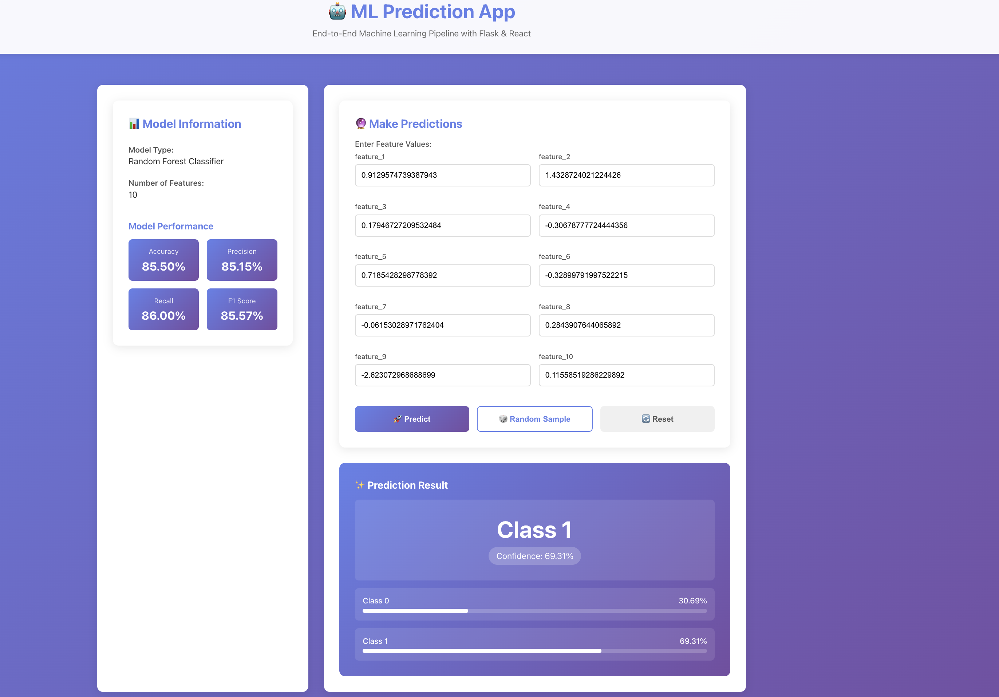

# 🤖 ML Prediction App - End-to-End Machine Learning Pipeline

A complete end-to-end machine learning application with a Flask backend API and React frontend. This project demonstrates a full ML pipeline from data generation to model training, serving, and prediction through a beautiful web interface.

## 🎬 Demo



## 📋 Table of Contents

- [Features](#features)
- [Tech Stack](#tech-stack)
- [Project Structure](#project-structure)
- [Prerequisites](#prerequisites)
- [Installation & Setup](#installation--setup)
- [Running the Application](#running-the-application)
- [API Endpoints](#api-endpoints)
- [Docker Deployment](#docker-deployment)
- [Project Workflow](#project-workflow)

## ✨ Features

- **Complete ML Pipeline**: Data generation, preprocessing, model training, and evaluation
- **RESTful API**: Flask-based API for model serving
- **Interactive UI**: Beautiful React frontend for making predictions
- **Model Metrics**: Display of accuracy, precision, recall, and F1 score
- **Real-time Predictions**: Make predictions with custom or random feature values
- **Dockerized**: Ready for containerized deployment

## 🛠️ Tech Stack

### Backend
- **Python 3.8+**
- **Flask** - Web framework
- **scikit-learn** - Machine learning library
- **pandas** - Data manipulation
- **NumPy** - Numerical computing
- **joblib** - Model serialization

### Frontend
- **React 18** - UI framework
- **Axios** - HTTP client
- **CSS3** - Styling

### ML Model
- **Random Forest Classifier** - Binary classification
- **StandardScaler** - Feature scaling

## 📁 Project Structure

```
Docker/
├── backend/
│   ├── __init__.py
│   ├── app.py                      # Flask API server
│   ├── requirements.txt            # Python dependencies
│   ├── data/
│   │   └── generate_data.py        # Dummy data generation
│   ├── ml_pipeline/
│   │   ├── __init__.py
│   │   └── train_model.py          # ML training pipeline
│   └── models/                     # Saved models (generated)
│       ├── model.pkl
│       ├── scaler.pkl
│       ├── feature_names.json
│       └── metrics.json
├── frontend/
│   ├── package.json
│   ├── public/
│   │   └── index.html
│   └── src/
│       ├── index.js
│       ├── index.css
│       ├── App.js
│       ├── App.css
│       └── components/
│           ├── ModelInfo.js        # Model information display
│           ├── PredictionForm.js   # Input form for predictions
│           └── PredictionResult.js # Prediction results display
├── Dockerfile.backend              # Backend Docker configuration
├── Dockerfile.frontend             # Frontend Docker configuration
├── docker-compose.yml              # Docker Compose configuration
├── .gitignore
└── README.md
```

## 📦 Prerequisites

- **Python 3.8+**
- **Node.js 14+** and **npm**
- **Docker** (optional, for containerized deployment)

## 🚀 Installation & Setup

### Backend Setup

1. **Navigate to the project root directory:**
   ```bash
   cd /path/to/Docker
   ```

2. **Create a Python virtual environment:**
   ```bash
   python3 -m venv venv
   ```

3. **Activate the virtual environment:**
   - macOS/Linux:
     ```bash
     source venv/bin/activate
     ```
   - Windows:
     ```bash
     venv\Scripts\activate
     ```

4. **Install Python dependencies:**
   ```bash
   pip install -r backend/requirements.txt
   ```

### Frontend Setup

1. **Navigate to the frontend directory:**
   ```bash
   cd frontend
   ```

2. **Install Node.js dependencies:**
   ```bash
   npm install
   ```

3. **Return to project root:**
   ```bash
   cd ..
   ```

## 🎯 Running the Application

### Step 1: Generate Dataset

```bash
python backend/data/generate_data.py
```

This will create a dummy dataset with 1000 samples and 10 features in `backend/data/dataset.csv`.

### Step 2: Train the ML Model

```bash
python backend/ml_pipeline/train_model.py
```

This will:
- Load and preprocess the data
- Train a Random Forest classifier
- Evaluate the model
- Save the trained model, scaler, and metrics to `backend/models/`

Expected output:
```
==================================================
Starting ML Pipeline
==================================================
Loading data...
Data loaded: 1000 samples, 10 features
Preprocessing data...
Train set: 800 samples
Test set:  200 samples
Training model...
Model training completed!
Evaluating model...

=== Model Performance ===
Accuracy:  0.8950
Precision: 0.8824
Recall:    0.9091
F1 Score:  0.8956

Model saved successfully!
==================================================
```

### Step 3: Start the Flask Backend

```bash
python backend/app.py
```

The Flask API will start on `http://localhost:5000`

### Step 4: Start the React Frontend

Open a new terminal window/tab:

```bash
cd frontend
npm start
```

The React app will start on `http://localhost:3000` and automatically open in your browser.

## 🌐 API Endpoints

### Health Check
```
GET http://localhost:5000/
```

### Get Model Information
```
GET http://localhost:5000/api/model-info
```

Response:
```json
{
  "status": "success",
  "model_type": "Random Forest Classifier",
  "n_features": 10,
  "feature_names": ["feature_1", "feature_2", ...],
  "metrics": {
    "accuracy": 0.895,
    "precision": 0.8824,
    "recall": 0.9091,
    "f1_score": 0.8956
  }
}
```

### Make Prediction
```
POST http://localhost:5000/api/predict
Content-Type: application/json

{
  "features": [0.5, -0.3, 1.2, 0.8, -0.1, 0.6, 0.9, -0.4, 0.2, 0.7]
}
```

Response:
```json
{
  "status": "success",
  "prediction": 1,
  "prediction_label": "Class 1",
  "probability": {
    "class_0": 0.23,
    "class_1": 0.77
  },
  "confidence": 0.77
}
```

### Generate Random Sample
```
GET http://localhost:5000/api/random-sample
```

## 🐳 Docker Deployment

### Build and Run with Docker Compose

1. **Build and start all services:**
   ```bash
   docker-compose up --build
   ```

2. **Access the application:**
   - Frontend: `http://localhost:3000`
   - Backend API: `http://localhost:5000`

3. **Stop the services:**
   ```bash
   docker-compose down
   ```

### Individual Docker Commands

**Backend:**
```bash
docker build -f Dockerfile.backend -t ml-app-backend .
docker run -p 5000:5000 ml-app-backend
```

**Frontend:**
```bash
docker build -f Dockerfile.frontend -t ml-app-frontend .
docker run -p 3000:3000 ml-app-frontend
```

## 🔄 Project Workflow

1. **Data Generation** → Creates synthetic dataset for training
2. **Data Preprocessing** → Splits data and scales features
3. **Model Training** → Trains Random Forest classifier
4. **Model Evaluation** → Calculates performance metrics
5. **Model Saving** → Serializes model and artifacts
6. **API Serving** → Flask API loads model and serves predictions
7. **UI Interaction** → React frontend communicates with API

## 📊 Using the Application

1. **View Model Information**: The left panel shows model type, features, and performance metrics
2. **Enter Feature Values**: Input values for each feature (10 features total)
3. **Random Sample**: Click to generate random feature values for testing
4. **Make Prediction**: Click "Predict" to get classification results
5. **View Results**: See predicted class, confidence, and probability distribution
6. **Reset**: Clear all inputs and start over

## 🔧 Customization

### Change Model Parameters

Edit `backend/ml_pipeline/train_model.py`:
```python
self.model = RandomForestClassifier(
    n_estimators=100,    # Number of trees
    max_depth=10,        # Maximum tree depth
    random_state=42
)
```

### Generate Different Dataset

Edit `backend/data/generate_data.py`:
```python
data = generate_dummy_data(
    n_samples=1000,      # Number of samples
    n_features=10        # Number of features
)
```

## 🐛 Troubleshooting

**Backend not starting:**
- Ensure model is trained first: `python backend/ml_pipeline/train_model.py`
- Check if port 5000 is available
- Verify all dependencies are installed

**Frontend not connecting:**
- Ensure backend is running on port 5000
- Check browser console for errors
- Verify CORS is enabled in Flask

**Model training fails:**
- Ensure dataset is generated first
- Check Python version (3.8+)
- Verify scikit-learn installation

## 📝 License

This project is open source and available for educational purposes.

## 👥 Contributing

Contributions are welcome! Feel free to submit issues and pull requests.

## 📧 Contact

For questions or feedback, please open an issue in the repository.

---

**Built with ❤️ using Flask, scikit-learn, and React**
